# TellyMCP Gallery

A compact, public-facing gallery for GitHub, npm, and release posts.

## Pair A Real Agent Session

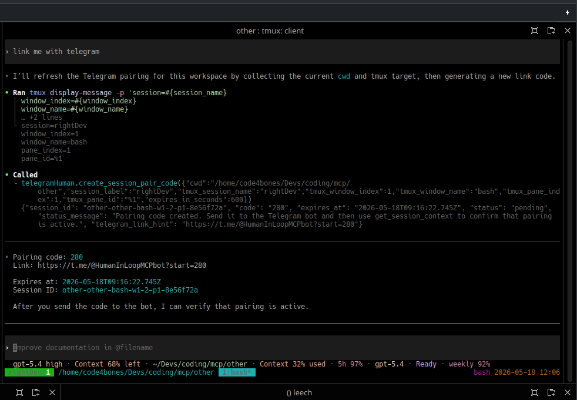

Pairing starts from the agent side: the session creates a short-lived Telegram code using the current workspace and tmux context.

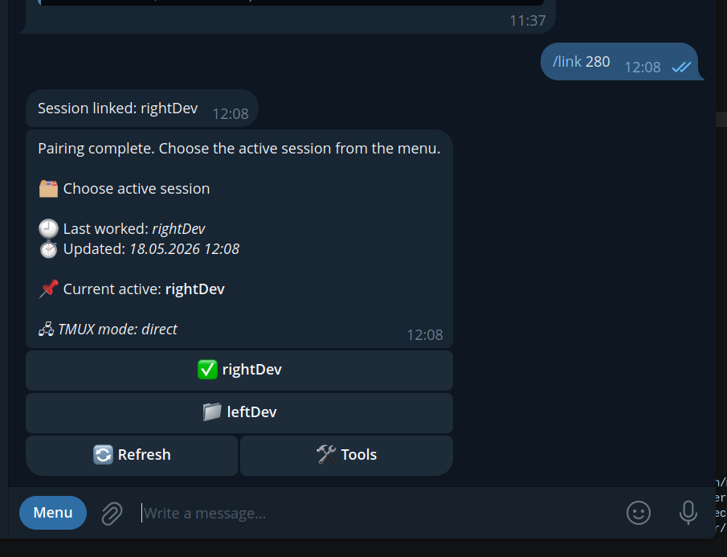

The bot links the session and turns it into a mobile-reachable control surface.

## Control A Session From Telegram

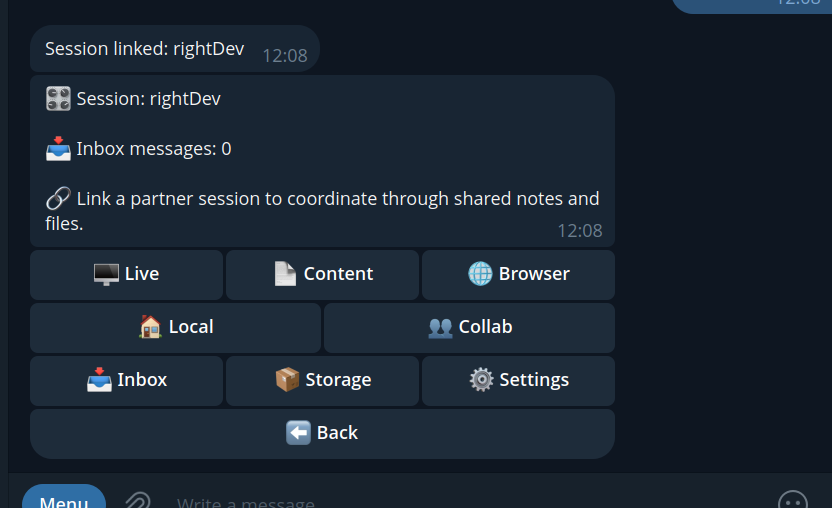

Each paired session gets a structured Telegram menu with `Live`, `Content`, `Browser`, `Inbox`, `Storage`, and `Collab`.

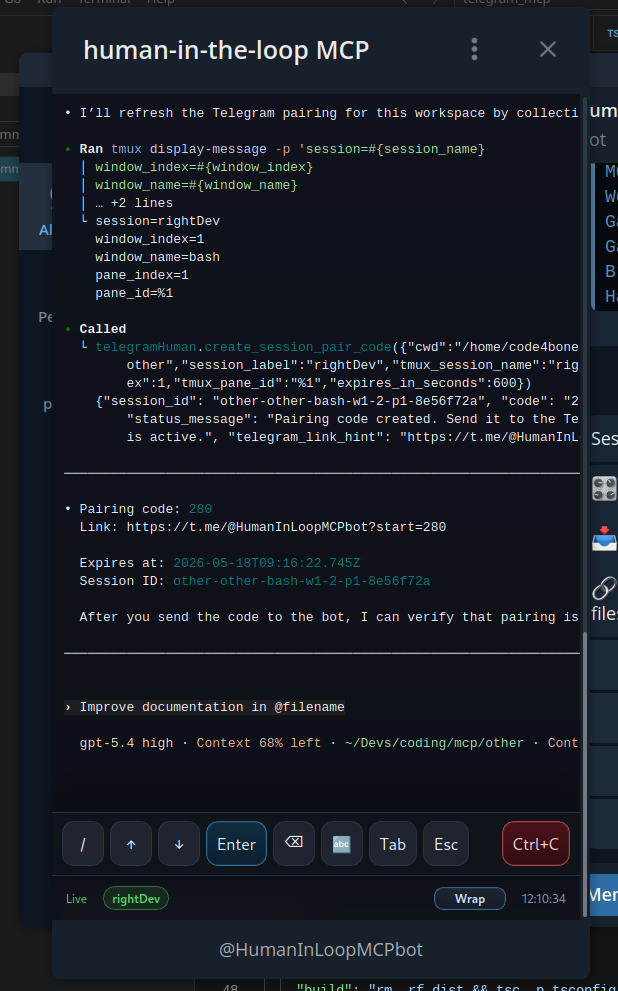

`Live` opens a Telegram Mini App over tmux: viewport, text input, wrap/unwrap, and safe control actions.

## Export Real Work Artifacts

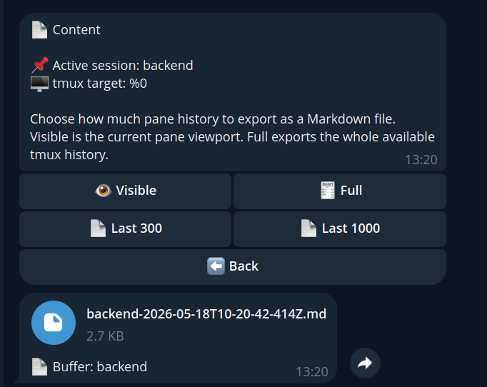

Pane history can be exported as Markdown and sent back to Telegram as a real file.

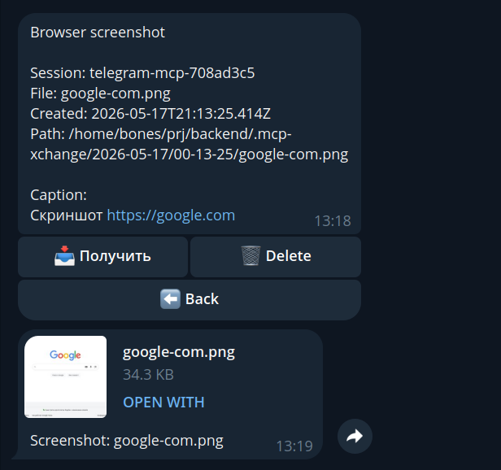

Browser screenshots are stored in `.mcp-xchange` and can be downloaded or cleaned up from Telegram.

## Collaborate Across Sessions

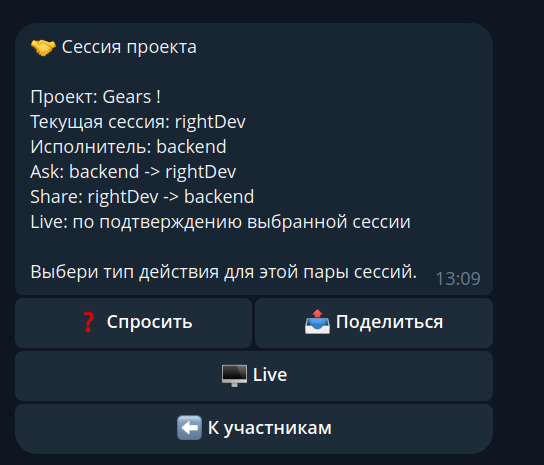

Inside a project, each session pair can `Ask`, `Share`, or request `Live`.

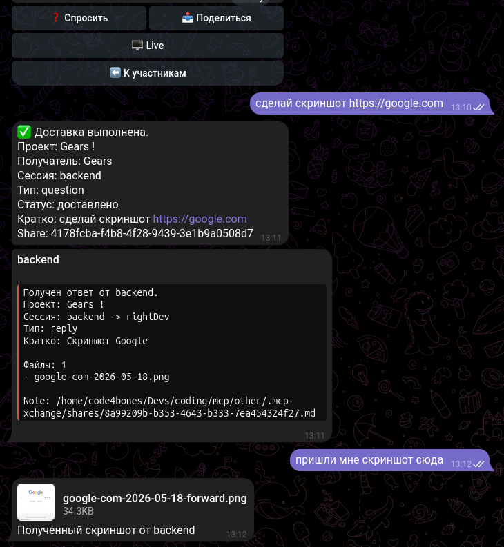

`Ask` routes work to another session and returns the result, including screenshots and files.

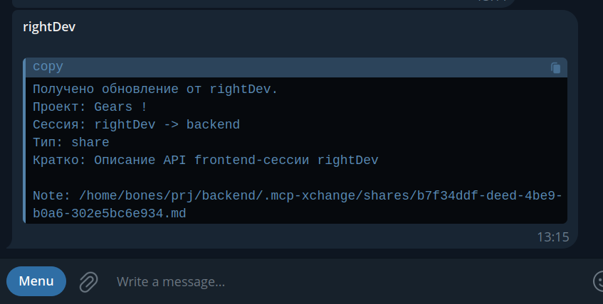

`Share` delivers structured updates and artifacts through the receiving session inbox, not as raw chat noise.

## Remote Live Needs Approval

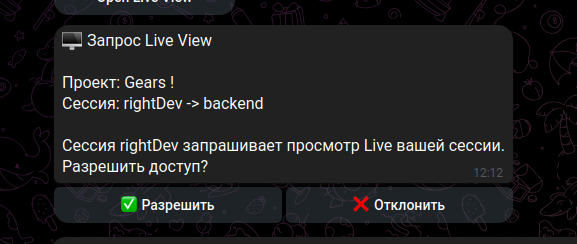

Remote `Live` access requires explicit approval from the target session.

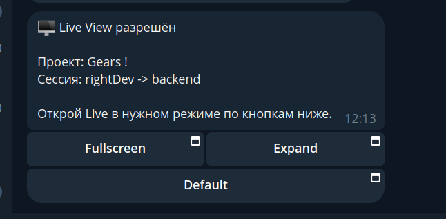

After approval, the requester gets a fresh `Live` launcher with explicit opening modes.

## Cross-Machine Live Relay

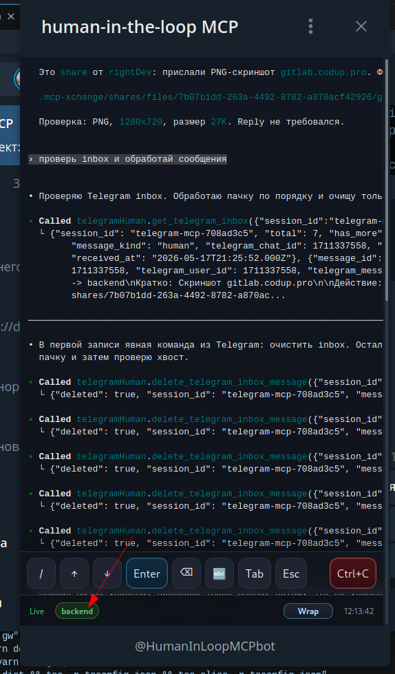

TellyMCP can relay `Live` and collaboration flows through a gateway, across bots and across machines.
