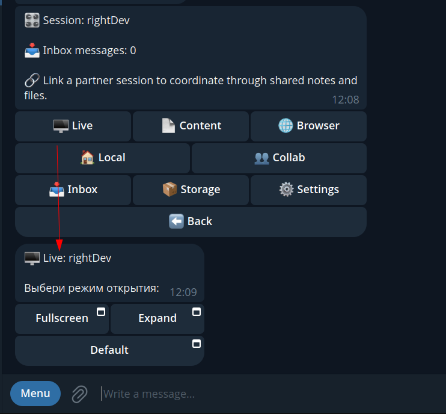
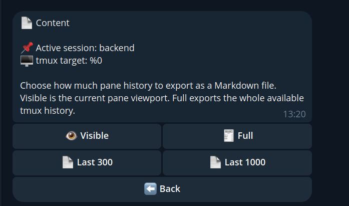
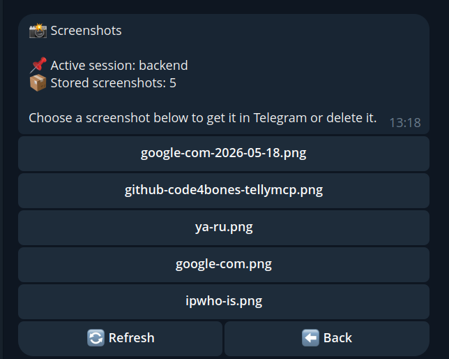
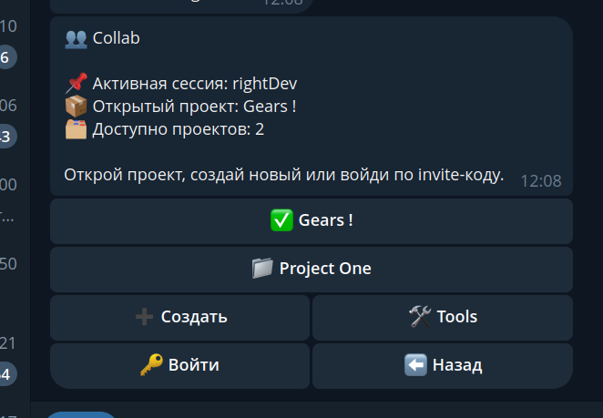
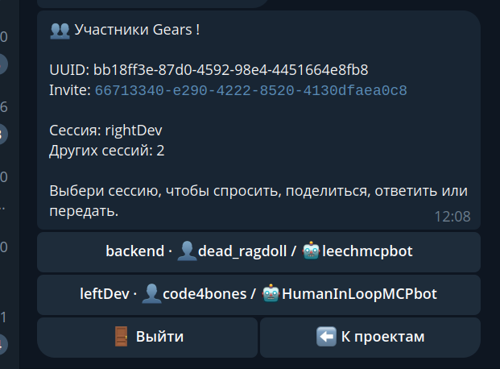
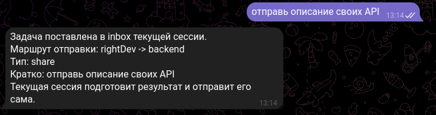
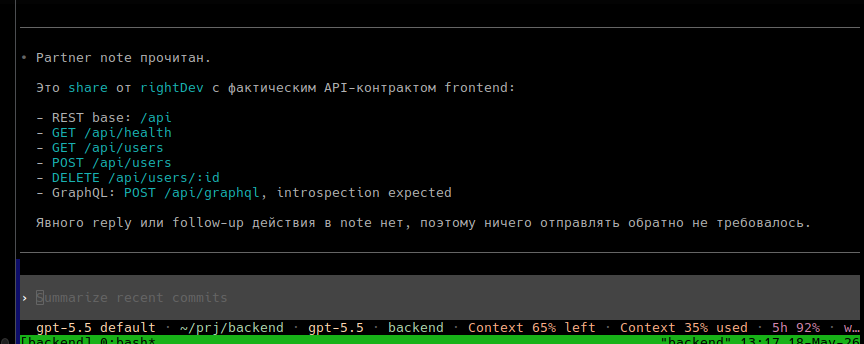

# Screenshots

Public product screenshots for `@deadragdoll/tellymcp`.

They are grouped by the main user flows:

- pairing a session with Telegram
- navigating the session menu
- exporting content and browser screenshots
- cross-session collaboration
- remote `Live` approval and `Live View`

## Pairing

### Agent creates a pairing code

The agent collects the current workspace and tmux context, then calls `create_session_pair_code`.

### Telegram confirms the linked session

After `/link <code>`, the bot binds the Telegram user to the session and shows the active session picker.

## Session Menu

### Main session menu

The main menu exposes the core surfaces:

- `Live`
- `Content`
- `Browser`
- `Local`
- `Collab`
- `Inbox`
- `Storage`
- `Settings`

### Live launcher with launch modes

`Live` opens a compact launcher message with explicit opening modes:

- `Fullscreen`
- `Expand`
- `Default`

### Local Live Mini App

After launch, the Telegram Mini App opens the local tmux viewport with compact controls, text input, wrap/unwrap, and `Ctrl+C` confirmation.

## Content And Browser

### Export tmux content as Markdown

The `Content` menu exports the current tmux pane as a Markdown file:

- current visible viewport
- full history
- fixed history windows such as `Last 300` and `Last 1000`

### Downloaded content buffer

The exported pane buffer is returned to Telegram as a regular Markdown document.

### Stored browser screenshots

The browser menu lists screenshots saved by `browser_*` tools inside `.mcp-xchange`.

### Download or delete a browser screenshot

A stored screenshot can be returned to Telegram or removed from storage.

## Collaboration

### Collab project list

The top-level `Collab` menu shows available projects and collaboration tools.

### Project participants

An opened project shows its participants and lets the user pick a target session.

### Session-pair actions

For a selected pair of sessions, the UI offers:

- `Ask`
- `Share`
- `Live`

### Ask another agent to produce a result

`Ask` routes a task to the selected session and delivers the reply, including attached files such as screenshots.

### Share is executed by the current session

`Share` is not delegated further. The current session prepares the result and sends only the result to the target session.

### Share notice received by the partner

The receiving session gets a structured Telegram notice with project, route, summary, and stored note path.

### Partner processes the shared result

The target agent reads the delivered note from its inbox flow and continues locally.

## Live Approval And Remote Live

### Remote Live access request

Remote `Live` access requires approval from the target session.

### Approved Live launcher

After approval, the requester receives a fresh launcher with the same opening modes.

### Remote Live over gateway relay

`Live` also works for remote sessions through the gateway relay path, including inbox-driven collaboration follow-ups.
